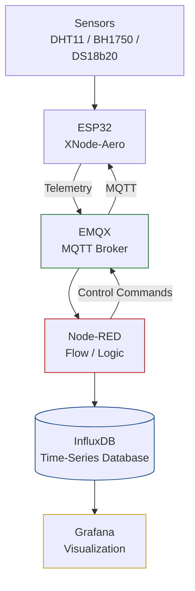

<p align="center">

  <picture>
    <source media="(prefers-color-scheme: dark)" srcset="../assets/prominD_dark.webp">
    <source media="(prefers-color-scheme: light)" srcset="../assets/prominD.webp">
    
  </picture>
</p>

<div align="center">
  <a href="https://t.me/X_MindWorld" target="_blank">
    
  </a>
  <a href="https://instagram.com/x_mindworld" target="_blank">
    
  </a>
  <a href="mailto:education.xmindworld@gmail.com" target="_blank">
    
  </a>
</div>


# 🌤 XNode-Aero
[🇬🇧 English](README.md)
### نود متن‌باز پایش محیطی مبتنی بر ESP32

**XNode-Aero** اولین عضو خانواده **XNode** در اکوسیستم XminD است؛ یک نود پایش محیطی مبتنی بر **ESP32** برای اندازه‌گیری پارامترهایی مانند دما، رطوبت و شدت نور و ارسال داده‌ها به یک زیرساخت IoT.

اما هدف پروژه فقط ساخت یک نود نیست.

هدف این پروژه این است که مفاهیم مختلف IoT را به‌جای آموزش‌های پراکنده، در قالب یک **سیستم واقعی و قابل اجرا** کنار هم قرار دهیم و مرحله‌به‌مرحله توسعه دهیم.

> **قرار نیست همه‌چیز از روز اول کامل باشد.**
> در طول توسعه، با مسائل واقعی مواجه می‌شویم، راه‌حل‌ها را بررسی و آزمایش می‌کنیم و نتیجه را مستند می‌کنیم.

---

## 🏗 ساختار



## ✨ چه مواردی را بررسی می‌کنیم

این پروژه به‌مرور مفاهیم زیر را پوشش می‌دهد:

* طراحی و برنامه‌نویسی ESP32
* خواندن و مدیریت سنسورها
* ارتباط Wi-Fi و MQTT
* پردازش و مسیریابی داده با Node-RED
* ذخیره‌سازی داده‌های زمانی با InfluxDB
* Visualization با Grafana
* راه‌اندازی سرویس‌ها با Docker و Docker Compose
* مدیریت خطا و افزایش Reliability سیستم

بخش مهم پروژه، **تجربه‌های واقعی حین توسعه** است؛ از مشکلات و اشتباه‌ها گرفته تا راه‌حل‌هایی که برای حل آن‌ها پیدا می‌کنیم.

---

## 🔧 سخت‌افزار

| Component    | Interface      | ESP32             |
| ------------ | -------------- | ----------------- |
| SSD1306 OLED | I²C            | GPIO 21 / GPIO 22 |
| BH1750       | I²C            | GPIO 21 / GPIO 22 |
| DHT11        | Digital        | GPIO 4            |
| Page Button  | Digital Input  | GPIO 12           |
| Status LED   | Digital Output | GPIO 2            |

> مشخصات سخت‌افزار ممکن است در طول توسعه تغییر کند.

---

## 📡 MQTT Topics

```text
xmind/xnode-aero/telemetry
xmind/xnode-aero/status
xmind/xnode-aero/cmd/led
```

نمونه Telemetry:

```json
{
  "temp": 24.5,
  "hum": 60,
  "lux": 320
}
```

---

## 🚀 وضعیت پروژه

XNode-Aero یک پروژه **در حال توسعه** است.

هدف این است که سیستم از یک نود ساده ESP32 به‌تدریج به یک معماری IoT قابل‌اعتمادتر و قابل‌گسترش‌تر تبدیل شود.

قابلیت‌ها و معماری پروژه در طول توسعه تغییر خواهند کرد و مستندات نیز هم‌زمان با آن به‌روزرسانی می‌شوند.

---

## 🐳 شروع سریع

### Backend

```bash
git clone https://github.com/X-Mind-for-World/XNode-Aero.git
cd XNode-Aero/docker
docker compose up -d
```

سرویس‌های اصلی:

* **EMQX** — MQTT Broker
* **Node-RED** — Data Flow & Logic
* **InfluxDB** — Time-Series Database
* **Grafana** — Visualization


پیکربندی Wi-Fi و MQTT را در فایل Configuration انجام دهید.

---

## 🗺️ نقشه راه

* [ ] Initial ESP32 node
* [ ] Sensor telemetry
* [ ] MQTT communication
* [ ] Dockerized backend
* [ ] Node-RED data pipeline
* [ ] InfluxDB storage
* [ ] Grafana dashboard
* [ ] Reliability improvements
* [ ] Bidirectional MQTT control
* [ ] OTA & security improvements

> Roadmap با پیشرفت پروژه تغییر خواهد کرد.

---

## 📖 مستندات

مستندات و تصمیم‌های فنی پروژه به‌مرور در repository اضافه می‌شوند.

هدف فقط انتشار کد نیست؛ **فرآیند ساخت و یادگیری پروژه نیز بخشی از XNode-Aero است.**

---

## 📄 License

Released under the **MIT License**.

**XminD — Build. Learn. Share.**

<p align="center">

  <picture>
    <source media="(prefers-color-scheme: dark)" srcset="../assets/XminD_logo_dark.webp">
    <source media="(prefers-color-scheme: light)" srcset="../assets/XminD_logo.webp">
    
  </picture>

</p>

<div align="center">
  <a href="https://t.me/X_MindWorld" target="_blank">
    
  </a>
  <a href="https://instagram.com/x_mindworld" target="_blank">
    
  </a>
  <a href="mailto:education.xmindworld@gmail.com" target="_blank">
    
  </a>
</div>
