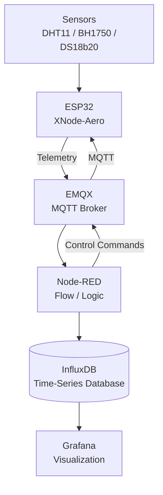

<p align="left">

  <picture>
    <source media="(prefers-color-scheme: dark)" srcset="../assets/prominD_dark.webp">
    <source media="(prefers-color-scheme: light)" srcset="../assets/prominD.webp">
    
  </picture>

</p>

# 🌤 XNode-Aero
[🇮🇷 فارسی](README-FA.md)
### Open-Source ESP32-Based Environmental Monitoring Node

**XNode-Aero** is the first member of the **XNode** family within the XminD ecosystem.

It is an ESP32-based environmental monitoring node designed to measure parameters such as temperature, humidity, and light intensity, and send telemetry data to an IoT backend.

But the goal of this project is not just to build a node.

The goal is to bring different IoT concepts together into a **real, working system** and develop it step by step instead of learning each technology in isolation.

> **The project is not expected to be complete from day one.**
> As development progresses, we will encounter real-world problems, investigate and test different solutions, and document what we learn along the way.

---

## 🏗 Architecture


## ✨ What We Explore

The project will gradually cover topics including:

* ESP32 development and firmware design
* Sensor interfacing and data acquisition
* Wi-Fi and MQTT communication
* Data processing and routing with Node-RED
* Time-series data storage with InfluxDB
* Data visualization with Grafana
* Service deployment with Docker and Docker Compose
* Error handling and system reliability

An important part of the project is documenting **real development experiences** — from problems and mistakes to the solutions we investigate and implement.

---

## 🔧 Hardware

| Component    | Interface      | ESP32             |
| ------------ | -------------- | ----------------- |
| SSD1306 OLED | I²C            | GPIO 21 / GPIO 22 |
| BH1750       | I²C            | GPIO 21 / GPIO 22 |
| DHT11        | Digital        | GPIO 4            |
| Page Button  | Digital Input  | GPIO 12           |
| Status LED   | Digital Output | GPIO 2            |

> Hardware specifications may change as the project evolves.

---

## 📡 MQTT Topics

```text
xmind/xnode-aero/telemetry
xmind/xnode-aero/status
xmind/xnode-aero/cmd/led
```

Example telemetry payload:

```json
{
  "temp": 24.5,
  "hum": 60,
  "lux": 320
}
```

---

## 🚀 Project Status

XNode-Aero is an **active work-in-progress project**.

The goal is to gradually evolve the system from a simple ESP32 node into a more reliable and extensible IoT architecture.

Features and architectural decisions may change as the project develops, and the documentation will evolve alongside them.

---

## 🐳 Quick Start

### Backend

Clone the main **XNode** repository:

```bash
git clone https://github.com/X-Mind-for-World/XNode.git
cd XNode/XNode-Aero/docker
docker compose up -d
```

Main backend services:

* **EMQX** — MQTT Broker
* **Node-RED** — Data Flow & Logic
* **InfluxDB** — Time-Series Database
* **Grafana** — Visualization


Configure your Wi-Fi and MQTT settings.

---

## 🗺️ Roadmap

* [ ] Initial ESP32 node
* [ ] Sensor telemetry
* [ ] MQTT communication
* [ ] Dockerized backend
* [ ] Node-RED data pipeline
* [ ] InfluxDB storage
* [ ] Grafana dashboard
* [ ] Reliability improvements
* [ ] Bidirectional MQTT control
* [ ] OTA & security improvements

> The roadmap may change as the project evolves.

---

## 📖 Documentation

Technical documentation and engineering decisions will be added to the repository over time.

The goal is not only to publish the final code, but also to document the **process of building and learning through the project**.

---

## 📄 License

Released under the **MIT License**.

**XminD — Build. Learn. Share.**


<p align="left">

  <picture>
    <source media="(prefers-color-scheme: dark)" srcset="../assets/XminD_logo_dark.webp">
    <source media="(prefers-color-scheme: light)" srcset="../assets/XminD_logo.webp">
    
  </picture>

</p>
